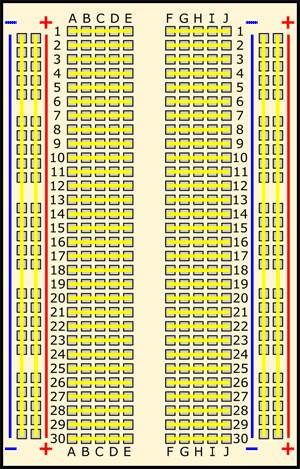

<h1 align="center"> ESP32-S3 Wroom-1 NodeMcu WiFi </h1>

# Content

1. [Chapter 1: Introduction to Basic Electronics](#chapter1)
    - [Chapter 1 - Part 1: Basic Components](#chapter1part1)
    - [Chapter 1 - Part 2: Basic Circuits](#chapter1part2)
    - [Chapter 1 - Part 3: Basic Tools](#chapter1part3)
2. [Chapter 2: Introduction to the ESP32-S3 Wroom](#chapter2)
    - [Chapter 2 - Part 1: ESP32-S3 Wroom Features](#chapter2part1)
    - [Chapter 2 - Part 2: ESP32-S3 Wroom Developmentboard Specification](#chapter2part2)
    - [Chapter 2 - Part 3: ESP32-S3 Wroom Developmentboard Pinout](#chapter2part3)
3. [Chapter 3: Setting Up the Development Environment](#chapter3)
    - [Chapter 3 - Part 1: Necessary Software](#chapter3part1)
    - [Chapter 3 - Part 2: Setup Steps](#chapter3part2)
4. [Chapter 4: First Projects with the ESP32-S3](#chapter4)
    - [Chapter 4 - Part 1: Building a Simple LED Circuit Controlled by a Push Button](#chapter4part1)
    - [Chapter 4 - Part 2: Blink an LED with the ESP32-S3](#chapter4part2)
    - [Chapter 4 - Part 3: Temperature Sensor with DHT11 in the ESP32-S3](#chapter4part3)


## <a name="chapter1"></a>Chapter 1: Introduction to Basic Electronics

#### <a name="chapter1part1"></a>Chapter 1 - Part 1: Basic Components

- **Resistors**: Limit the amount of current that flows through a circuit.

- **Capacitors**: Store and release electrical energy.

- **LEDs**: Light-emitting diodes that light up when a current passes through them.

- **Buttons/Switches**: Used to manually open or close circuits.

- **Transistors**: Used for amplification and switching of electrical signals.

- **Diodes**: Allow current to flow in only one direction.

- **Sensors**: Devices that detect changes in the environment, such as temperature, light, humidity, etc.

#### <a name="chapter1part2"></a>Chapter 1 - Part 2: Basic Circuits

- **Series and Parallel**: Learn how components behave when connected in series or parallel.

- **Ohm’s and Kirchhoff’s Laws**: Fundamentals to understand voltage, current, and resistance.

#### <a name="chapter1part3"></a>Chapter 1 - Part 3: Basic Tools

- **Multimeter**: To measure voltage, current, and resistance.

- **Breadboard**: To temporarily assemble circuits.

- **Jumpers**: Wires used to make connections on the breadboard.

- **Power Supply**: To provide power to your circuits.

## <a name="chapter2"></a>Chapter 2: Introduction to the ESP32-S3 Wroom

#### <a name="chapter2part1"></a>Chapter 2 - Part 1: ESP32-S3 Wroom Features

- **CPU**: Dual-core Xtensa LX7 with up to 240MHz, supporting vector instructions for optimized machine learning tasks.

- **Memory**: 512KB SRAM.

- **Flash**: Up to 16MB.

- **Connectivity**: WiFi 802.11 b/g/n and Bluetooth 5 (BLE).

- **GPIOs**: Many configurable input/output pins.

- **Protocols**: Supports SPI, I2C, UART, PWM, ADC, DAC, USB OTG, etc.

- **Artificial Intelligence and ML Features**: Vector instructions optimized for machine learning and voice recognition tasks.

#### <a name="chapter2part2"></a>Chapter 2 - Part 2: ESP32-S3 Wroom Developmentboard Specification

[ESP32-S3 NodeMCU Developmentboard Specification](https://github.com/vitorstabile/esp32s3wroom1nodemcuwifi/blob/main/img/ESP-32-S3_NodeMCU_Developmentboard_Specification.pdf)

#### <a name="chapter2part3"></a>Chapter 2 - Part 3: ESP32-S3 Wroom Developmentboard Pinout

[ESP32-S3 NodeMCU Developmentboard Pinout](https://github.com/vitorstabile/esp32s3wroom1nodemcuwifi/blob/main/img/ESP-32-S3_NodeMCU_Developmentboard_Pinout.png)

## <a name="chapter3"></a>Chapter 3: Setting Up the Development Environment

#### <a name="chapter3part1"></a>Chapter 3 - Part 1: Necessary Software

- **Arduino IDE**: A popular development environment for microcontrollers.

- **CP210x Driver**: So that your computer recognizes the ESP32-S3.

#### <a name="chapter3part2"></a>Chapter 3 - Part 2: Setup Steps

- **1: Install the Arduino IDE**: Download and install the Arduino IDE from the official Arduino website.

- **2: Install the CP210x Driver**: Download the driver from the official Silicon Labs website and install it.

- **3: Configure the ESP32-S3 in the Arduino IDE**:

  - Open the Arduino IDE.

  - Go to File > Preferences.

  - In Additional Board Manager URLs, add: https://dl.espressif.com/dl/package_esp32_index.json.

  - Go to Tools > Board > Boards Manager, search for esp32 and install the package.

## <a name="chapter4"></a>Chapter 4: First Projects with the ESP32-S3

#### <a name="chapter4part1"></a>Chapter 4 - Part 1: Building a Simple LED Circuit Controlled by a Push Button

- **The wires Convention**

In the world of DC electronics, the accepted wiring convention is that the red wire carries the positive voltage, and the black is circuit ground. 

Usually the red is marked as + (plus) and the black is marked as – (minus).

- **Current Flow**

Electric current is defined to flow from positive to negative.

Electrons flow from negative to positive because they are negatively charged and are attracted to the positive charge

In Eletronic, the flow is from postive (red wire) to negative (black/blue wire)

- **How to use a Breadboard**

A breadboard typically consists of the following sections

- **Terminal Strips (Rows)**: The main area where components are inserted. Each row is connected internally.

- **Bus Strips (Power Rails**): Usually along the sides, marked with red (positive) and blue/black (negative) lines. These are used to provide power and ground connections throughout the board.

<br>

<div align="center"><br><sub> Breadboard - (<a href='https://www.sciencebuddies.org/science-fair-projects/references/how-to-use-a-breadboard'>Work by Ben Finio, Science Buddies / Science Buddies</a>) </sub></div>

<br>


- **Necessary Components**
  - Breadboard
  - LED
  - Push Button
  - 10kΩ resistor
  - Jumpers
  - 2 Batteries of 1.5V

- **Circuit Assembly**
  - Connect the data pin of the DHT11 to GPIO 4 of the ESP32, power to 3.3V, and GND.

#### <a name="chapter4part1"></a>Chapter 4 - Part 2: Blink an LED with the ESP32-S3

- **Necessary Components**
  - 220Ω resistor
  - LED
  - ESP32-S3
  - jumpers

- **Circuit Assembly**
  - Connect an LED to the GPIO 2 pin of the ESP32 (positive side of the LED) and the other side to GND with a 220Ω resistor in series.
 
- **Code**:

 ```cpp
void setup() {
  pinMode(2, OUTPUT); // Set GPIO 2 as output
}

void loop() {
  digitalWrite(2, HIGH); // Turn the LED on
  delay(1000);           // Wait for 1 second
  digitalWrite(2, LOW);  // Turn the LED off
  delay(1000);           // Wait for 1 second
}
```

- **Upload the Code:**:
  - Connect the ESP32 to the computer via USB.
  - Select the correct board and port in Tools > Board and Tools > Port.
  - Click the upload button (right arrow).

#### <a name="chapter4part2"></a>Chapter 4 - Part 3: Temperature Sensor with DHT11 in the ESP32-S3

- **Necessary Components**
  - 220Ω resistor
  - LED
  - ESP32-S3
  - jumpers
  - DHT11 sensor

- **Circuit Assembly**
  - Connect the data pin of the DHT11 to GPIO 4 of the ESP32, power to 3.3V, and GND.
 
- **Code**:

 ```cpp
#include "DHT.h"

#define DHTPIN 4     // DHT11 sensor pin
#define DHTTYPE DHT11 // Sensor type

DHT dht(DHTPIN, DHTTYPE);

void setup() {
  Serial.begin(115200);
  dht.begin();
}

void loop() {
  float h = dht.readHumidity();
  float t = dht.readTemperature();
  Serial.print("Humidity: ");
  Serial.print(h);
  Serial.print(" %\t");
  Serial.print("Temperature: ");
  Serial.print(t);
  Serial.println(" *C ");
  delay(2000);
}
```

- **Upload the Code:**:
  - Connect the ESP32 to the computer via USB.
  - Select the correct board and port in Tools > Board and Tools > Port.
  - Click the upload button (right arrow).
